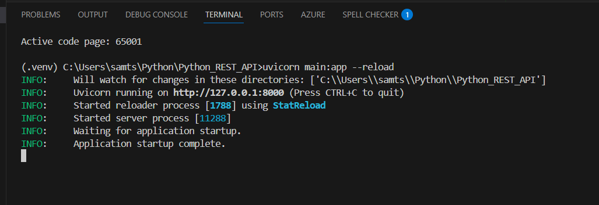
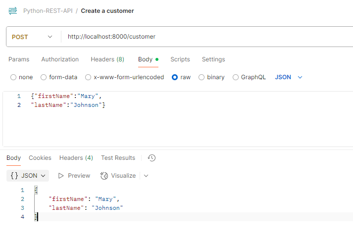
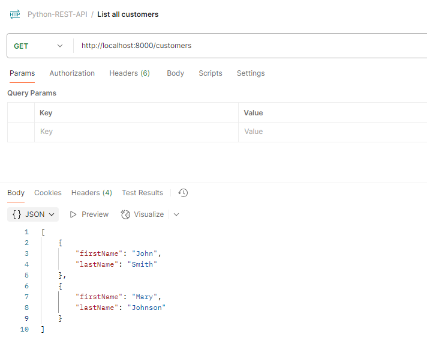
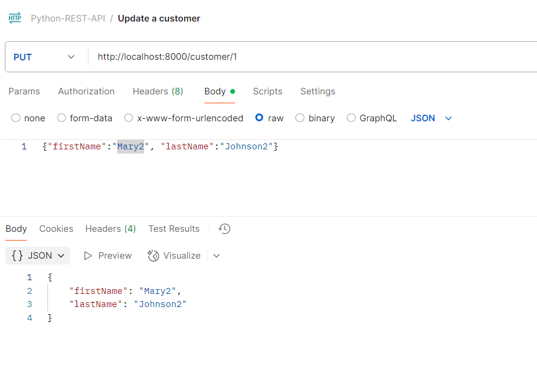
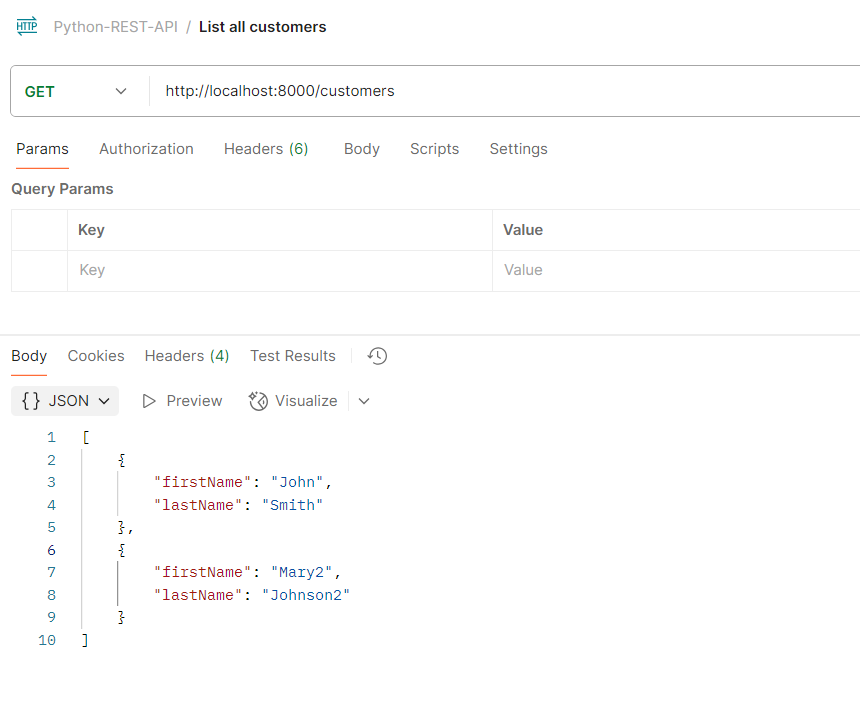
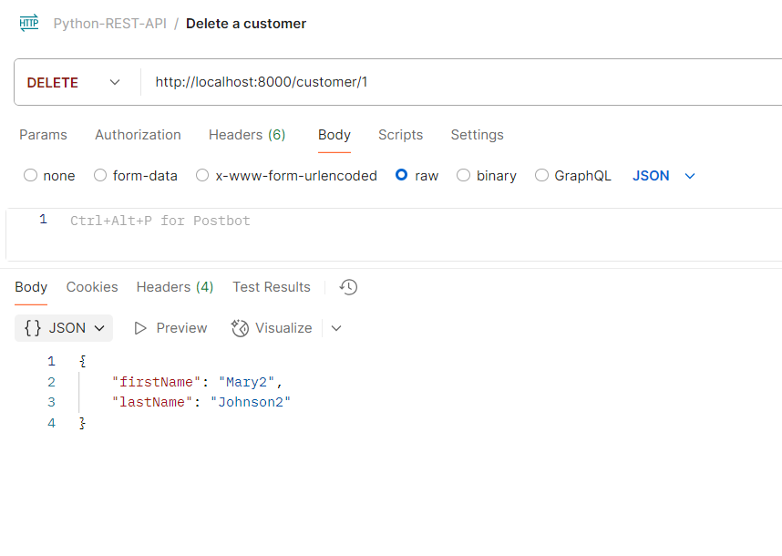
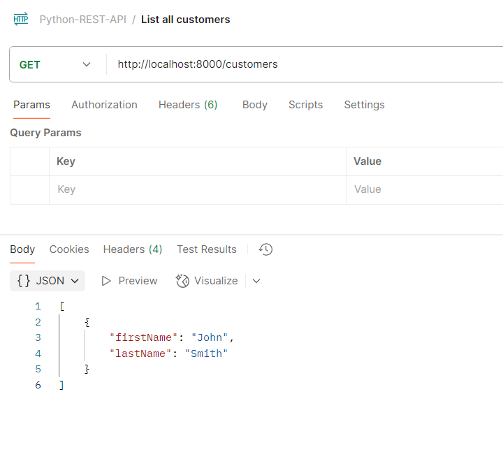

# Showcased how to create RESTful services in Python with FastAPI  
## Applied Technologies: Python, REST API, FastAPI, JSON, HTML
Start: uvicorn main:app --reload

Add a customer: 
Post http://localhost:8000/customer
{"firstName":"Mary",
"lastName":"Johnson"}

List all customers: 
Get http://localhost:8000/customers

Update a customer: 
Put http://localhost:8000/customer/1

List all customers: 

Delete a customer: 
Delete http://localhost:8000/customer/1

List all customers: 

